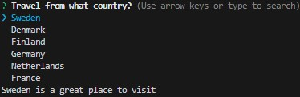

## Step 1

Starting with the main.mjs that was created in InstallDependencies.md:

 

    ```
    import autocomplete from 'inquirer-autocomplete-standalone';
    import { searchCountries } from './Countries.mjs';

    const answer = await autocomplete({
        message: 'Travel from what country?',
            source: async (input) => {
                const filteredCountries = await searchCountries(input)
                return filteredCountries.map(country => {
                    return {
                        value: country,
                        description: `${country} is a great place to visit`
                    }       
                })
            }
    })
    console.log(answer) 
    
     ```
__You will need the Countries.mjs as well in order for this code to work as intended. It can be found in the InstallDependencies.md__

## Step 2

By default if the list is longer than 7 it will be paginated. So this should be used if you want to lower the limit of choices shown per page. The example below is an example of if we wanted only 3 items listed per page:

    ```
        import autocomplete from 'inquirer-autocomplete-standalone';
        import { searchCountries } from './Countries.mjs';

        const answer = await autocomplete({
            message: 'Travel from what country?',
            pageSize: 3,
                source: async (input) => {
                    const filteredCountries = await searchCountries(input)
                    return filteredCountries.map(country => {
                        return {
                            value: country,
                            description: `${country} is a great place to visit`
                        }           
                    })
                }
        })
        console.log(answer) 
        
        ```

## Result

### Before page limit added



### After page limit added

