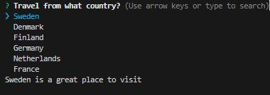
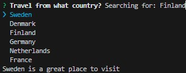
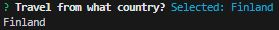

### Step 1

Starting with the main.mjs that was created in InstallDependencies.md.md:

    ```
    import autocomplete from 'inquirer-autocomplete-standalone';
    import { searchCountries } from './Countries.mjs';

    const answer = await autocomplete({
        message: 'Travel from what country?',
            source: async (input) => {
                const filteredCountries = await searchCountries(input)
                return filteredCountries.map(country => {
                    return {
                        value: country,
                        description: `${country} is a great place to visit`
                    }
                })
            }
    })
    console.log(answer) 

    ```
__You will need the Countries.mjs as well in order for this code to work as intended. It can be found in the InstallDependencies.md__

## Step 2

Take a look at how the documentation says to use the transformer function: 

        (string, { isFinal: boolean }) => string

This function takes the string that the user selects and transforms or manipulates it. The isFinal boolean value will be true only once the user has selected an answer. In the example below when its true it prints `Selected: ${input}`. In order to have the other text show up we must include the feature suggestOnly and have it set to True. What it does is it makes the user have to hit tab to select the answer and then they can hit enter to lock it in. When the user selects the value by hitting tab the isFinal value will be false and `Searching for: ${input}` will be displayed. If you don't include suggestOnly then the text `Searching for: ${input}` will never be displayed.


## Step 3

Adding a basic example of this function to the code above yields:

    ```
    import autocomplete from 'inquirer-autocomplete-standalone';
    import { searchCountries } from './Countries.mjs';

    const answer = await autocomplete({
    message: 'Travel from what country?',
    suggestOnly: true,
        transformer: (input, { isFinal }) => {
            selection
            if (isFinal) {
            return `Selected: ${input}`;      // Text shown once user has entered their selection 
            } else {
            return `Searching for: ${input}`; // Text shown while user is selecting
            }
        },
        source: async (input) => {
            const filteredCountries = await searchCountries(input);
            return filteredCountries.map(country => ({
            value: country,
            description: `${country} is a great place to visit`
            }));
        },
    });

    console.log(answer);
    ```

## Result

### Inital View


### isFinal is False, User has selected answer by hitting tab



### isFinal is True, User has submitted selection by hitting enter

